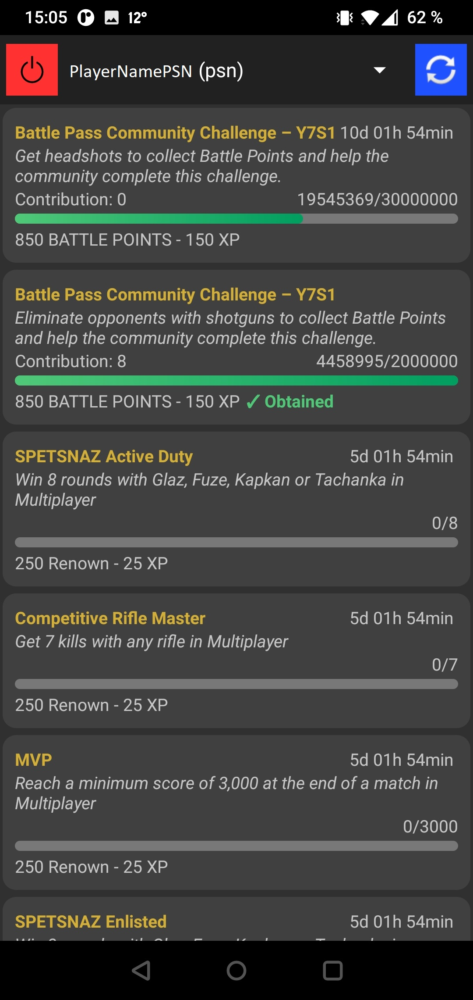
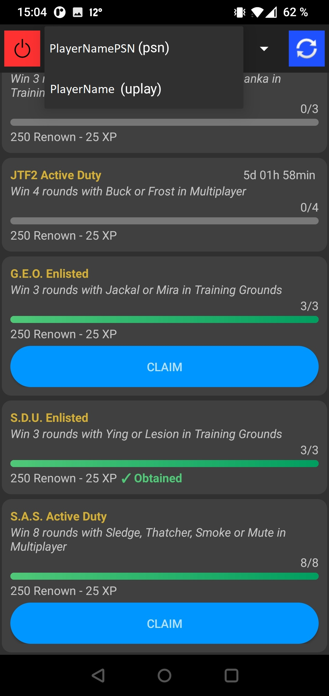

# R6 Challenges

A simple Android app to check and claim periodic challenges on Rainbow Six Siege for any platform.

# Workflow

- Connect to the desired account
- The app will find each platform where the game has been played on, and select the last platform used to set the default profile
- Switch platform by clicking on the name
- Refresh the challenges manually by clicking on the associated button
- Claim completed challenges
- Log out by clicking on the associated button, eg to change account

# Screenshots

  
*Main screen*

# License

See the [GNU General Public License v3.0](LICENSE.txt) file for license rights and limitations.